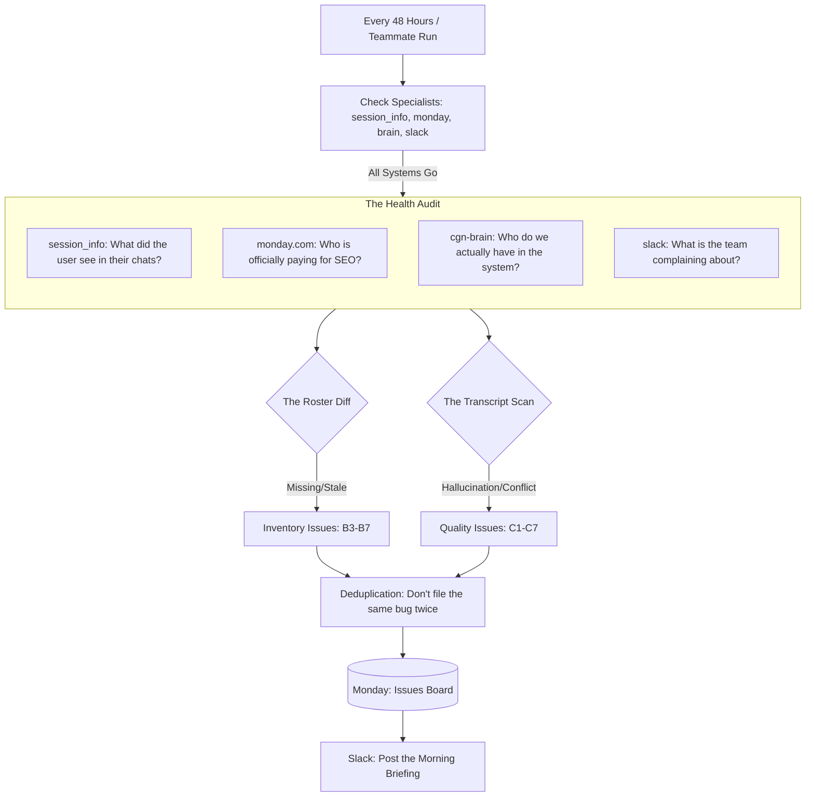

# CGN Brain Health Inspector: The Ultimate System Blueprint (A-Z)
### The Authoritative Guide to How We Protect the Integrity of Our Client Knowledge Base

This document is the definitive, exhaustive "Master Blueprint" for the CGN QA Plugin. It has been meticulously verified against all project specifications to ensure 100% accuracy in how data is fetched, analyzed, and reported.

---

## 1. The Vision: Why This System Exists
The **CGN Brain** is a complex ecosystem. Information flows from Google Drive into a RAG (Retrieval-Augmented Generation) system, which is then used by teammates in thousands of chat sessions. Mistakes can happen at any stage:
1.  **The Input:** A client is missing from the brain but present in our business records.
2.  **The Storage:** A client folder is empty or has a "stale" name.
3.  **The Output:** The AI gives a wrong answer during a live user session.

The **Health Inspector** is the automated bridge that connects these dots. It ensures that what we **sell** (Monday.com records) matches what we **know** (Brain data) and what we **say** (User sessions).

---

## 2. The Connector Bridge: Our Specialist Team
The Inspector relies on four specific external systems (MCPs). If any are missing, the audit is incomplete.

### A. The Personal Assistant (`session_info`)
*   **Role:** Accessing the **Local User History**.
*   **What it does:** This is the most personal connector. It has the clearance to "reach into" your local Claude/Cowork history and pull up your **recent chat sessions**. 
*   **Why it's used:** It is the only way the system can "see" what you are seeing. It looks at your transcripts to find times where you were frustrated, where the AI gave a tool error, or where a "Brain Conflict" occurred.
*   **Core Tool:** `list_sessions`, `read_transcript`.

### B. The Business Manager (`monday.com`)
*   **Role:** The **Master Roster** of Active Clients.
*   **What it does:** It holds the "Source of Truth" for who is a paying client. The Inspector queries the **Client Database Board** (ID `18245097205`) to get the canonical list of Active SEO clients.
*   **Why it's used:** We cannot trust the Brain to tell us who is missing—it doesn't know what it doesn't know. We must compare the Brain against our actual business records in Monday.com to find "Ingestion Gaps."
*   **Core Tool:** `get_board_items_page`, `create_item` (for the Issues board).

### C. The Knowledge Librarian (`cgn-brain`)
*   **Role:** The **Actual Inventory** of Information.
*   **What it does:** It holds the actual folders, documents, and brain-logic.
*   **Why it's used:** The Inspector asks the Librarian, "Who is currently in your system?" and "How many documents does Client X have?". It provides the **Actual Roster** which we then compare against the Monday.com **Master Roster**.
*   **Core Tool:** `list_clients`, `get_client_stats`, `auth_status`.

### D. The Security Guard (`slack`)
*   **Role:** The **External Feedback** Monitor.
*   **What it does:** It scans 10 internal channels (like `#seo` and `#client-success`) for "Distress Signals" left by teammates.
*   **Why it's used:** Not every bug is found in a transcript. Sometimes a teammate just mentions a problem at the "water cooler" (Slack). The Security Guard catches these mentions so they aren't forgotten.
*   **Core Tool:** `slack_search_public_and_private`.

---

## 3. The Exhaustive "A to Z" Workflow

### Phase 1: Pre-Audit & Safety (Steps 1-3)
1.  **Wake-Up:** Triggered every 48 hours or manually by a teammate.
2.  **Safety Check:** The Inspector pings all 4 connectors (`session_info`, `monday.com`, `cgn-brain`, `slack`). 
    *   *Critical Rule:* If `session_info` is missing, we cannot scan sessions. If `monday.com` is missing, we cannot verify the client roster. The audit stops if these "Safety Critical" tools are gone.
3.  **The Key Test:** Calls `auth_status` on the Librarian. If we can't log in, we log a High Severity **A1** error.

### Phase 2: Detecting "Silent Killers" (The 5 Scans)

#### Scan A: The Pulse Probe (System Performance)
Checks the speed and responsiveness of the Librarian. If it takes > 30 seconds to answer, it’s a "Silent Failure" (Category **E1**) that ruins the user experience.

#### Scan B: Listening to the Office (Slack Scan)
Searches the last 7 days of Slack for keywords like *"hallucinating," "brain error,"* or *"wrong data."* It captures the **Permalink** (the exact link to the message) so the fix-it team has context.

#### Scan C: Reviewing Your Sessions (Transcript Audit)
This is where the `session_info` connector works its magic. It looks at **your personal history** for:
*   **The Frustration Signal:** Keywords like *"that's not right"* or *"you're confusing clients"*.
*   **The Conflict Flag (C2):** This is the highest-value signal! It's where the AI says, *"I've found two conflicting pieces of data."* The Inspector grabs this immediately.
*   **The Data Hole (D1):** Scans for `[UNKNOWN - NEEDS CLIENT INPUT]`. This is our "Knowledge Gap" detector.

#### Scan D: The Roster Diff (Monday vs. Brain)
This is the "Inventory Audit." 
1.  **Step 1:** Pulls the "Active SEO" list from **Monday.com**.
2.  **Step 2:** Pulls the "Actual" list from the **Brain**.
3.  **Step 3:** Compares them using **Fuzzy Logic**.
    *   If a client is in Monday but NOT in the Brain → **B4 (Missing Client)**.
    *   If a client is in the Brain but has 0 documents → **B6 (Ghost Client)**.
    *   If the names are different (e.g., "WISA" vs "WISA Design") → **B7 (Stale Name)**.

#### Scan E: The Pop Quiz (Canary Queries)
Once a week, it asks the Brain 5 "Gold Standard" questions with known answers. If the Brain gets even one wrong, we flag **C3 (Factual Drift)**.

---

## 4. Intelligent Persistence: The Deduplication "Fingerprint"
We never clutter the Monday board. Every bug is assigned a "Fingerprint":
`[Category] :: [Client ID] :: [Short Hash of the Error]`

*   **Rule 1 (The Re-Affirmation):** If a bug fingerprint is already on the board and "New," we just add a note: *"Seen again today by [User]! Occurrence count: 8."*
*   **Rule 2 (The Regression):** If the bug was "Resolved" but came back, we create a **New Item** but add a link saying, *"Warning: This issue has returned."*

---

## 5. Manual Triage: The "Loose Note" Cleanup (Step 6)
Humans often add quick notes to the Monday board. The Inspector finishes every audit by cleaning these up:
1.  Finds "Loose Items" (no metadata).
2.  Identifies the client using **Authoritative Override** logic (from `client-id-mappings.md`).
3.  Categorizes the bug (e.g., "Hallucination" → **C5**).
4.  Sets the **Action Owner** (E2M for tech, CGN for data).
5.  Deletes the original messy note.

---

## 6. The "Morning Briefing" (Slack Digest)
The final step is the report to `#e2m-and-cgn`. It is designed for "At-a-Glance" reading:
*   **Health Status:** ✅ (All good), ⚠️ (Action needed), ❌ (Major system issue).
*   **New Items:** Links to the brand-new tickets.
*   **Auto-Triaged:** A report on how many manual notes were "cleaned up."

---

## 7. The Issue Taxonomy (The Master Table)

| Code | Type | Severity | Why it's flagged |
| :--- | :--- | :--- | :--- |
| **A1-A5**| System | **High** | The engine is broken (Auth, Crashes). |
| **B3-B7**| Inventory| **High/Med**| The list is wrong (Missing, Renamed, Ghost). |
| **C1-C7**| Quality | **High/Med**| The AI is confused (Hallucination, Conflict, Bleed). |
| **D1-D3**| Gaps | **Med** | We are missing facts (Unknown tags, missing services). |
| **E1-E3**| Perf | **Med** | The AI is slow or timid. |

---

## 8. Summary Logic Flow (The 30,000 Ft View)

